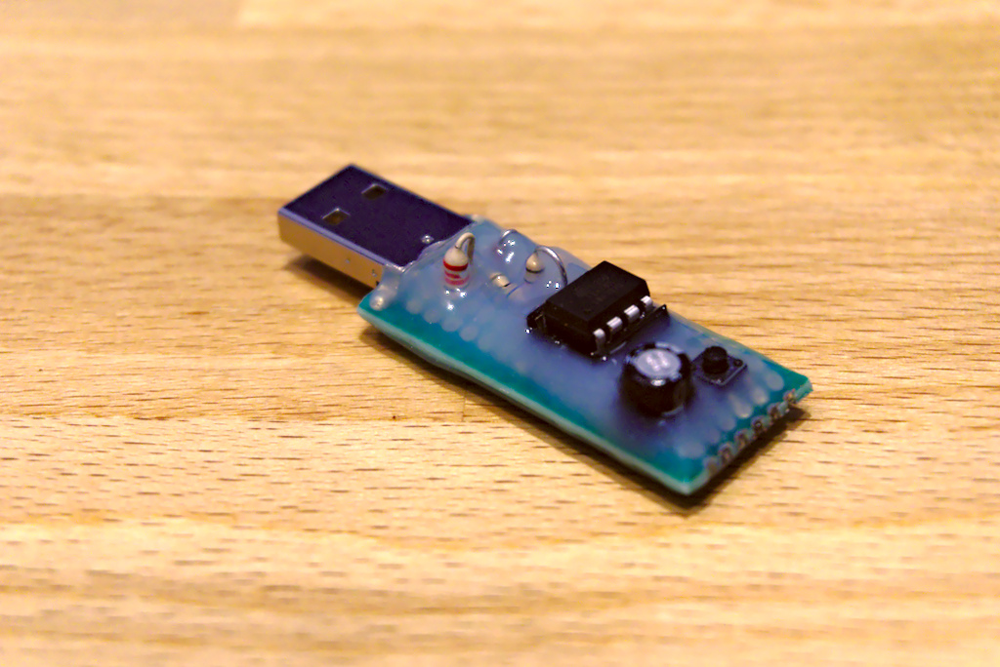

# Fake USB mouse

An extremely simple to build USB mouse emulator that constantly moves your mouse pointer while you are AFK; practically 
a slightly more reliable [Homer's typing bird](https://www.imdb.com/title/tt0701144) which hopefully won't start 
a nuclear meltdown.


When enabled, the mouse pointer will constantly move following a squared pattern.

Largely based on [V-USB](https://www.obdev.at/products/vusb/index.html) sample schematics, designed around an ATTiny85. 
Similar devices from the Tiny family can probably be used as well without any or minimal modifications to the 
schematics.


The internal RC oscillator is used in place of an external XTAL. A calibration function borrowed from 
[https://www.obdev.at/products/vusb/easylogger.html](https://www.obdev.at/products/vusb/easylogger.html) takes care of 
tuning the oscillator when the device is plugged in the USB port.

The entire device fits easily on a small protoboard; below a prototype which has been covered in hot glue to reinforce 
it and avoid damages when plugged / unplugged. The pushbutton on PB4 toggles mouse moving on/off.  



### Build the firmware

Install cmake then from the repo root (where this file is located):

```
mkdir build && cd build
cmake -DCMAKE_BUILD_TYPE=Release .. && make hexfile
```

This will produce fakemouse.hex; there is also a pre-built copy in the root of this repo.

### Flash the firmware

You can use your favorite flashing method to flash the firmware onto the ATTiny; don't forget to also program the 
fuses as following:

```
Low:  0xE1
High: 0xDD
```
 
If you happen to have a [usbtiny](https://learn.adafruit.com/usbtinyisp/avrdude) and avrdude, you can plug it in and 
just compile and flash everything 

```
mkdir build && cd build
cmake -DCMAKE_BUILD_TYPE=Release .. && make flash && make fuses
```

If necessary, tune the CmakeList.txt variables AVRPROG and PROGDEVICE to your setup and repeat the above.

Use this responsibly.
 


